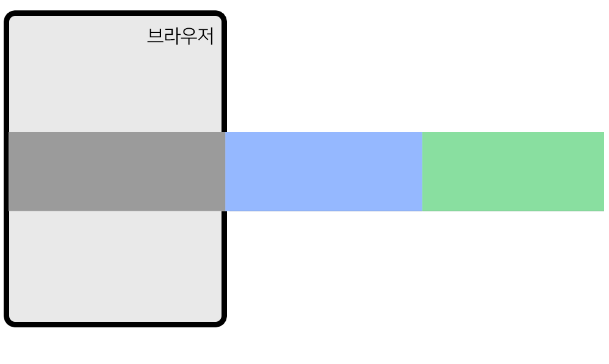

# 코딩애플 자바스크립트 기초강의 정리

## 자바스크립트를 쓰는 이유

요즘엔 다양한 걸로 쓰이지만 가장 근본은 html조작

## JS맛보기 코드

```html
<h1 id="hello">안녕하세요</h1>
<script>
  document.getElementById("hello").innerHTML = "안녕";
  document.getElementById("hello").style.color = "red";
  document.getElementById("hello").style.fontSize = "16px";
</script>
```

이런식으로 id가 hello인 요소들의 내용, 폰트색, 크기 다 JS로 조절 가능

## alert박스 만들기

> UI만드는 스텝-> 1. 미리 html,css를 만들어놓고 평소에는 숨겨놓고 2. 필요할때 보여달라고 코드짜기
> 즉, 평소에는 `display:none`으로 해놓고 필요할때 `display:block`으로

결과는

```html
<div class="alert-box" id="alert-window">알림창임</div>
<button onclick="document.getElementById('alert-window').style.display='block'">
  버튼
</button>
```

## 함수

자주 쓰는 js코드는 함수로 간단하게 쓸 수 있음.
`document.getElementById('alert-window').style.display='block'`는 너무 기니까

`function 열기() {document.getElementById("alert-window").style.display = "block";}` 로 정의하고 저 코드가 쓰일곳에 `열기()`를 대신 사용하면 편함

## 함수에 구멍 뚫기

열기,닫기 함수를 따로 만드는게 아니라 하나로 통합해보자

`function 알림창(구멍) {document.getElementById("alert-window").style.display = 구멍;}`

## id가 아닌 class명으로 찾기

`document.getElementsByClassName("message")[0]`
클래스는 여러태그에 있을 수 있기 때문에 위에서부터 몇번째를 원하는지 [0] 이런식으로 꼭 붙여야 함

## 이벤트리스너

함수로 축약했다고 해도 버튼에다가 onclick을 넣는건 좀 더러움. 그래서 버튼에 id로 close를 부여하고 자바스크립트에
`document.getElementById('close').addEventListener('click', function(){});`
추가하면 close아이디를 가진 놈이 클릭되면 이 함수를 실행하겠다 가능

click이 아니라 mouseover(마우스 갖다대기), scroll등으로 다양한 이벤트리스너 작성가능

## Bootstrap

### 부트스트랩이란?

우리가 자주 쓰는 UI를 직접 개발하긴 귀찮으니까 갖다쓰게 해주는 라이브러리

css를 갖다 쓰고싶으면
`<link href="https://cdn.jsdelivr.net/npm/bootstrap@5.3.7/dist/css/bootstrap.min.css"rel="stylesheet"integrity="sha384-LN+7fdVzj6u52u30Kp6M/trliBMCMKTyK833zpbD+pXdCLuTusPj697FH4R/5mcr"crossorigin="anonymous"/>`
를 head에 추가하면 됨. 
그리고 부트스트랩 사이트에서 원하는거 검색해서 갖다 쓰면 됨. 

참고로 head에 여러 스타일시트를 참조할때 맨 밑에 있는게 우선순위가 크기 때문에 잘 조절해서 써야함 


## 클래스 탈부착
평소에는 `<ul class="list-group">`으로 하고 안보이게 했는데 `<ul class="list-group show">`와 같이 클래스를 붙여서 보이게 하는 기법 
`document~~~ .classList.toggle('show')` 이렇게 하면 show가 있을때는 없애주고 없을때는 추가해줌

## 쿼리셀렉터 
지금까지는 id나 class에 따라 getelementby를 나눠썼는데 이게 좀 귀찮다. 
그래서 `querySelector`를 쓰자. 
document.querySelector('.alert-box')라고 하면 alert-box클래스중 맨 위에 나오는 애를 찾아줌. 
id로 찾으려면 #쓰면 되는거고. 
하나가 아니라 전부 찾고 싶으면 `querySelectorAll`을 쓰자. 


## 여러 자바스크립트 라이브러리 
지금까지 하고 느꼈겠지만 자바스크립트는 너무 길고 더러움. 그래서 좀 더 쉽게 바꿔주는 여러 라이브러리가 생김. 대표적으로 `jQuery`,`React`,`Vue`등이 있음. 리액트랑 뷰는 자바스크립트 좀 알아야 가능하니까 제일 쉬운 `jQuery`부터 만져보자

설치는 그냥 html파일 body태그 끝나기 전에 스크립트를 몰아넣으면 됨. 
jquery cnd 검색해서 스크립트 복붙하면 됨 

그러면 hello클래스의 내용을 바꿀려면  `$('.hello').html('바보');` 이렇게 하면 됨 


## one-way animation 만드는법

1. 시작스타일 class로 만들고 
2. 최종 스타일 class로 만들고 
3. 원할때 최종스타일로 변하라고 js짜로 
4. 시작스타일에 `transition: all 1s`추가 

예를들어 버튼을 누르면 모달창이 뜨게 만들려면 

.black-bg {
  (생략)
  visibility : hidden;
  opacity : 0;
}

.show-modal {
  visibility : visible;
  opacity : 1;
}

이렇게 시작과 최종스타일을 만들고 (참고로 애니메이션은 display속성  쓰지 말고 visibility속성을 써야 잘 동작함)
버튼을 누르면 show-modal클래스가 부착되게 하고 
시작스타일인 .black-bg에 `transition : all 1s;`만 추가하면 됨 


## 폼이 비어있으면 로그인 안하고 경고창 띄우기 
input으로 입력받은 값은 `document.getElementByID().value`로 알 수 있음
그 값이 비었는지는 `===''`로 비교 가능 

경고창 띄우고 폼전송 막으려면 `e.preventDefault()` 추가하면 됨 


## 다크모드 만들기 
아이디어는 버튼이 눌린 횟수를 변수가 기억해서 짝수면 라이트, 홀수면 다크로.
body태그에 클래스를 선언해서 버튼 누를때마다 클래스가 바뀌게 선언하면 될듯(아니면 클래스 탈부착하거나)

## 변수 종류 3가지 
var: 자유로운 변수 
let : 재선언 못함.
const : 재선언도 못하고 재할당도 못함. 


## 시간 관련 문법 
`setTimeout(function(){}, 1000)` : 1초 뒤에 실행
`setInterval(function(){}, 1000)` : 1초마다 특정 함수를 시행

저 function자리에 다른 함수를 넣을수도 있음. 대신 `함수()`가 아니라`함수`꼴로 넣어야한다.


## 캐러셀 만들기 

이런식으로 3개를 길게 이어붙이고 이동시키면 됨 

## 스크롤 관련 
`window.addEventListener('scroll',function(){});`으로 스크롤을 감지할 수 있다. 
`window.scrollTo(0,100)`으로 특정 좌표로 화면을 이동시킬수 있다. 
현재 스크롤의 위치를 알려면 `console.log(window.scrollY)`으로 얼만큼 y축으로 내려갔는지 확인가능 

스크롤을 응용해서 스크롤을 100정도 내리면 로고를 작게 한다던지 구현 가능 

## 외부 자바스크립트 가져오는법 
원하는 곳에 `<script src="tab.js"></script>` 넣으면 됨 


## 쓸만한 자바스크립트 라이브러리 
1. Swiper 
이미지 슬라이드 되는거 쉽게 만들어줌 

2. Chart.js 
차트 만들어줌 

3. Animate On Scroll
스크롤 내리면 요소가 서서히 등장하는 애니메이션을 만들고 싶을 때 쓰면 좋음


## 어레이/오브젝트 
`var car=['소나타' , 50000, 'white'];` -> 어레이
`var car2={name:'소나타',price:50000};`->오브젝트 
파이썬의 리스트, 딕셔너리랑 같네 

## 랜더링 방식 
서버가 클라이언트에게 html문서를 보낼때는 두가지 방식이 있다.
1. `server-side rendering`: 서버에서 완성된 html을 준비하고 배포하기 
2. `client-side rendering`: 빈html파일+ 데이터를 같이 보내고 클라이언트쪽에서 js를 돌려서 html을 완성시키게 하기

## 백틱 활용
문자열 사이에 변수를 넣고싶으면 `'문자열'+변수+'문자열'` 이런식으로 해도 되지만 
백틱을 활용해서 `'문자열${변수}문자열'` 이런식으로 해도 됨


## forEach, for in반복문 
`forEach`는 어레이(리스트), `for in`은 오브젝트(딕셔너리)용이다. 
```JAVASCRIPT
var pants=[28,30,32]
pants.forEach(function(val,index){
  console.log(val)
})
```
이런식으로 리스트를 순회하면서 그 값을 val에 저장해준다. 
인덱스도 알 수 있는데 선택이라 안해도 되긴 함 
> 자꾸 ()안에 function 넣는데(콜백함수라고 함) 이거 왜 넣냐면 자바스크립트 만든사람이 이렇게 하래요

```JAVASCRIPT
var obj={ name : 'kim', age : 20 }
for (var key in obj){
  console.log(key)
}
```
딕셔너리는 이런식으로 for in을 쓰자(이건 파이썬이랑 비슷하네)


## arrow function
지금까지 function이라는 키워드를 많이 썼다. 
근데 이거 좀 더 간편하게 쓸 수 있는데 그게 arrow function임 

`function(a)` 대신에 `(a)=>` 쓰면됨. 


## JS로 HTML 생성하는법 

```JAVASCRIPT
<div id="test">
  
</div>

<script>
  var a = '<p>안녕</p>';
  document.querySelector('#test').insertAdjacentHTML('beforeend', a);
</script>
```
이렇게 하면 test아이디를 가진 div 태그 안쪽 맨 밑에 추가하라는 뜻이다. 

만약 특정 태그 안의 내용을 전부 초기화 즉 없애고 싶으면 그 태그를 찾아서 `innerHTML=''` 해주면 된다
